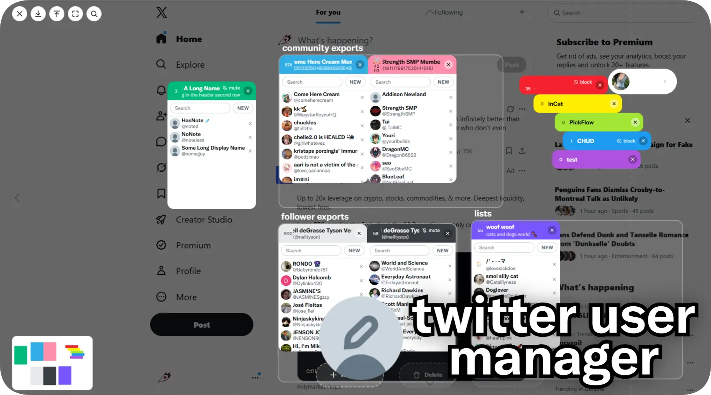

<h4 align="center">additional account info and an overlay for sorting them!</h4>

drag any profile picture or name to bring up an overlay where you can create folders and categories to add users into. 
  
to install on chrome, simply clone the repository, enable developer mode in chrome extensions and "load unpacked", pointing to the cloned repo.   
to install on firefox, first turn it into a <b>zip file</b>, and disable extension verification through <code>xpinstall.signatures.required = false</code> in about:config, or through firefox nightly/dev.  
if neither work, then the firefox versions you're installing are too gated and you might need to find a workaround. you can try using the userscript version in releases!

<h5>shortcuts:</h5>
<ul>
  <li><code>Ctrl + `</code> opens/closes the overlay from anywhere</li>
  <li>hold <code>Ctrl</code> to hide all elements from the extension (mostly just for clean screenshots) </li>
  <li>while dragging someone: <code>1</code>-<code>9</code> to quick drop into that folder,  <code>Esc</code> to cancel</li>
  <li>right click a folder, user, category or empty canvas for its menu</li>
  
</ul>

<h5>see also:</h5>
<table>
  <tr valign="center">
    <td>
      <a href="https://github.com/sogful/twitter-flags"><b>@sogful/twitter-flags</b></a> 
      change x/twitter feature flag values from a clean interface
    </td>
  </tr>
</table>
